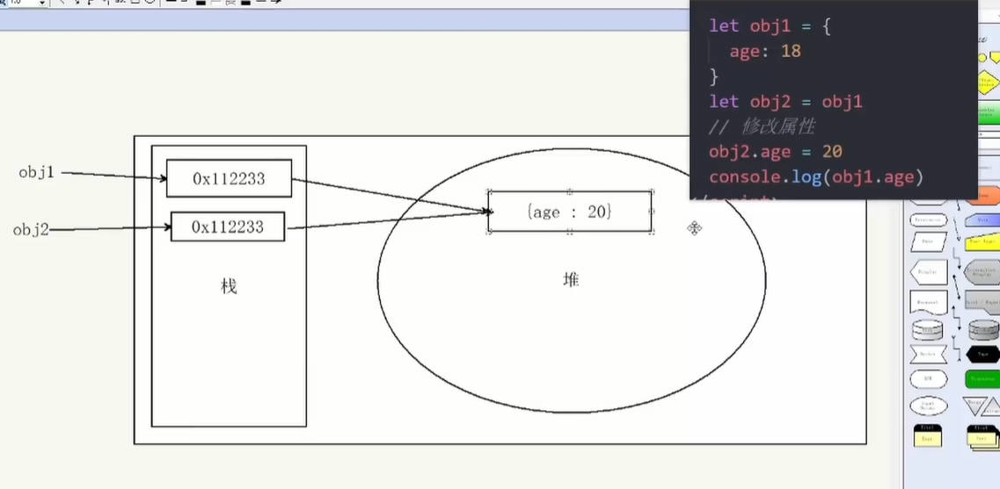

# 运行在浏览器的js分这么几部分

1. 是js本身的逻辑语法和数据结构等
2. 和文档(html、css)交互，控制网页变化
3. 和浏览器交互控制浏览器行为
4. 是和后端交换数据

---

# JS简介 -- MDN文档

- JavaScript -- 是一种运行在客户端(浏览器)的编程语言,实现人机交互
- js是类型比较宽泛的语言
- html和css -- 是一种标记语言
- js的组成
  - js的语言基础:ECMAScript
    - 变量,分支语句,循环,对象
  - Web APIs:
    - DOM 操作文档：对页面元素移动、大小、添加删除等操作
    - BOM 操作浏览器：页面弹窗、检测窗口宽度、存储数据到浏览器

---

# js书写位置

## 内部js

- 在html里面，用script标签，`</body>`上面
- 写在下面的body，来控制上面的元素
- 拓展：alert("你好")页面弹出警告对话框

  ```html
  <body>
  <!-- 内部js -->


  <script>
    // 页面弹出警示框
    alert("你好")

  </script>
  </body>
  ```

## 外部js

- 引入 script标签 + src属性

  ```html
  <body>

  <!-- 外部js -->
  <script src="02js书写位置-外部.js"></script>
  </body>
  ```

## 内联/行内js

- 代码写在标签内部
- js的字符串尽量用单引号
- 这样就可以双引号里放单引号了

  ```html
  <body>
    <button onclick="alert('nihao')" >点击</button>
  </body>
  ```

- js规则，两句话换行，可以不加分号；如果两句话之间不加分号并且不换行就不行
- html和css一句话后面一定要加分号

---

# js输入输出语法

## 执行顺序

- 按HTML文档流执行js代码
- alert()和prompt(),会跳过页面渲染先被执行

## 字面量 - literal

- (类比python的数据类型)
- 1000是数字字面量
- 'heima'是字符串字面量
- []数组字面量
- {}对象字面量

## 输出语法

- document.write('你好')
  - 这是向文档输出/向body内输出内容
  - 如果输出的内容写的是标签，也会被解析成网页元素
- alert('xx')
  - 页面弹出警告对话框
  - alert('')是省略方式，全写是window.alert()
  - 所以这个是在window (窗口)中输出
- console.log('对不对')
  - 控制台输出语法，程序员调试使用
  - 控制台指的是f12里的console面板

## 输入语句

- prompt('请输入你的年龄')
  - 显示一个对话框，对话框中包含一条文字信息，用来提示用户输入文字
  - 所以这个是在window (窗口)中输出

```js
  <script>
    // 1.文档输出内容
    document.write('你好')
    document.write('<h1>标题</h1>')


    ```javascript
    // 两种输出
    // document.write(`姓名：${uname}`)
    // document.write('姓名'+uname)
    ```

    // 2.控制台打印输出给程序员
    // clog + tap
    console.log('对不对')

    // 3.输入语句
    prompt('请输入你的年龄')
  </script>
```

---

# 变量

- 变量是什么
  - 是计算机中用来存储数据的容器，是一个用来装东西的盒子

## 变量的基本使用

- 提倡一行只声明一个变量
- 1.声明变量(创建变量)：声明关键词+变量名(标识)
  - 语法：let 变量名
- 2.变量赋值：赋值号:"="

```html
<script>
  // 1.声明一个年龄变量
  let age

  // 2.给变量赋值
  age = 18

  // 3.输出age变量
  alert(age)

  //4.声明的同时直接赋值，变量初始化
  let age = 18

</script>
```

- 3.更新变量

```html
<script>
  // 更新变量
  let age = 18

  age = 19
  console.log(age)

</script>
```

- 4.声明多个变量，中间用逗号隔开

```html
<script>

  let age = 18, uname = 'pink'

  console.log(age, uname)

</script>
```

```javascript
// 加分号
// ;[num1,num2] = [num2,num1]
```

- 变量的本质
  - 内存：计算机中存储数据的地方，相当于一个空间
  - 变量本质：是程序在内存中申请一块用来存放数据的小空间

## 变量命名规则与规范

- 规则
  - 不能用关键词 let
  - 不能数字开头
  - 严格区分大小写
- 规范
  - 起名有意义
  - 遵循小驼峰命名法
    - 第一个单词首字母小写，后面每个单词首字母大写：userName
  - 普通变量和函数小驼峰，函数动词加名词

# 数组

- 数组(array):一种将一组数据存储在单个变量名下的方式
- 声明语法:let 数组名 = [数据1,数据2,....,数据3]

  - let arr = []
- 索引从0开始
- 数组可以存储任意类型的数据
- 数据的编号也叫索引或下标

  ```html
  <script>
   let arr =[]

   arr[0] = 1
   arr[1] = 9

   // document.write(arr[1])
   console.log(arr)
  </script>
  ```

  ```html
  <script>
   let week = ['星期一','星期二','星期三','星期四','星期五','星期六','星期日']
   console.log(week[6]);
   console.log(week.length);
  </script>
  ```

# var,let,const的区别

## 作用域（最核心区别）

var：函数作用域（function-scoped）。它只在函数内部生效，在代码块（如 if、for）中声明的 var 变量会 “穿透” 代码块，变成外层作用域的变量。
let/const：块级作用域（block-scoped）。只在声明它的代码块（{} 包裹的区域）内生效，代码块外部无法访问。

## 变量提升（Hoisting）

var：会被 “变量提升” 到作用域顶部，且默认值为 undefined。
let/const：也会被提升，但处于 “暂时性死区（TDZ）”，在声明前访问会直接报错，不会返回 undefined。

## 重复声明

var：允许在同一作用域内重复声明同一个变量，后声明的会覆盖前一个。
let/const：不允许在同一作用域内重复声明，重复声明会直接报错。

## 可修改性（仅 const 特殊）

var/let：声明的变量可以修改值，也可以重新赋值。
const：声明的是 “常量”，必须在声明时赋值，且赋值后不能重新赋值；但如果 const 声明的是对象 / 数组，其内部的属性 / 元素可以修改（因为保存的是引用地址）。

## 总结

- 作用域：var 是函数作用域，let/const 是块级作用域（优先使用）。
- 变量提升：var 提升后值为 undefined，let/const 提升后处于暂时性死区，声明前访问报错。
- 赋值规则：var/let 可重复声明、可修改；const 不可重复声明、声明时必须赋值、不可重新赋值（但对象 / 数组内部可修改）。
- 最佳实践：日常开发中优先使用 const（值确定不变时），值需要修改时用 let，完全避免使用 var（避免作用域和提升带来的坑）。

# 常量 - const

- 当某个量不会被重新赋值，就可以用const声明
- 常量不允许重新赋值,声明的时候必须赋值(初始化)

```html
<script>
 const PI = 3.14

 console.log(PI);

</script>
```

## const 优先(数组和对象)

- const语义化更好
- react框架,基本const
- let:基本数据类型,变化赋值的用
- const:引用数据类型,地址不变可以,数组和对象

# 数据类型(基本5个和引用3个)

- 强数据类型的语言:c,java (int num = 10;)
- 弱数据类型的语言:js (只有当我们赋值了,才知道是什么数据类型)
- 控制台的输出后面就跟着数据类型

## 基本数据类型

-数字,字符,布尔,undefined,null空类型

### number 数字型

- 整数,小数,正负数
- 算数运算符(加,减,乘,除,取余(求模))
- NaN 计算错误,是粘性的(任何对NaN的操作都会返回NaN)

### string 字符串型

- 通过单引号，双引号，或反引号()包裹发的数据,js推荐使用单引号
- 转字符串
- 字符串拼接(+)

  ```html
  <script>
    let str = 'pink'
    let str1 = 'pink'
    let str2 = `中文`
    console.log(str2);

  </script>
  ```

- 模板字符串(反引号)

  ```html
  <script>
    let age = 18

    document.write(`我今年${age}岁了`)

  </script>
  ```

- padStart 和padEnd

  - `padStart(targetLength, padChar)`：在字符串**开头（左侧）** 填充指定字符，直到字符串总长度达到 `targetLength`；如果原字符串长度已经≥目标长度，直接返回原字符串。
  - `padEnd(targetLength, padChar)`：在字符串**结尾（右侧）** 填充指定字符，直到字符串总长度达到 `targetLength`；同理，原字符串长度足够时不做任何修改。

  ```html
  字符串.padStart(目标长度[, 填充字符]);
  字符串.padEnd(目标长度[, 填充字符]);
  ```

### boolean 布尔型

- 有两个固定的值true(真),false(假)

### undefined 未定义型

- 只声明变量,不赋值的情况下,变量的默认值为undefined
- 判断一个值不能if（xxx==undefined）,要xxx\==void 0,核心原因：undefined 可被篡改，void 0 是 “纯净” 的 undefined
- undefined 是 JS 中的原始值，但它本质是全局对象（window/global）的一个属性，而非语言层面的关键字 —— 这意味着在非严格模式下，它可以被人为修改，导致判断失效。
- void 0 的本质：永远返回 “原始、不可篡改” 的 undefined,void 是 JS 的运算符，它的作用是：执行后面的表达式，然后无条件返回原始的 undefined（和任何变量 / 属性无关）

```html
<script>
  function checkUndefined() {
    // 局部作用域覆盖 undefined
    var undefined = 123;
    var a;
    console.log(a == undefined); // false
    console.log(a == void 0);   // true
  }
  checkUndefined();

</script>
```

### null 空类型

- js里面null仅仅代表"空","无"或者"值未知"的特殊值
- null作为尚未创建的对象
- null一般都是先复值,将来是json时候用的

### null和undefined的区别

- undefined 表示没有赋值
- null表示赋值了,但是内容为空

### 检测数据类型

- 通过typeof关键字检测数据类型
- 作为运算符:typeof x
- 函数形式: typeof(x)

```html
<script>
  let num = 10
  console.log(typeof num)

</script>
```

### 类型转换

- 使用表单,prompt获取过来的数据默认是字符串类型的,此时就不能直接简单进行加法运算
- 隐式转换

  - +号作为正号解析可以转换成数字型
  - 任何数据和字符出去按相加的结果都是字符串
- 显式转换

  - Number
  - 转换成数字类型
  - 如果字符串里面有非数字,转换失败NaN
  - NaN也是number类型的数据,代表非数字
- parseint(数据) -- 只保留整数,只切整数,不四舍五入
- parseFloat(数据) -- 可以保留小数

```html
  <body>
  <script>
    let str = '123'
    console.log(Number(str));
    console.log(typeof Number(str));
  
    console.log(Number('pink'))
  
  </script>
  </body>
  
```

## 引用数据类型

### obgject 对象

- 对象(object) :js里面的一种数据类型
  - 数组是有序的数据集合,对象是无序的数据集合
  - 可以详细描述某个事物

#### 对象的使用

- 对象声明语法

  - (优先级),[数组],{对象}

  ```js
  let 对象名 = {
    属性名:属性值,
    方法名:函数
  }

  let 对象名 = new Object()
  ```

- 对象有属性和方法组成

  - js里，一切皆对象
  - 属性:信息或叫特征(名词):手机尺寸,颜色
  - 方法:功能或叫行为(动词):手机打电话,发短信

  ```html
  <script>
    let pink = {
      uname:'pink',
      age:18,
      gender:'女'
    }
    console.log(pink);
  </script>
  ```

- 对象的使用

  ```html
  <script>
    let obj = {
      goods:'小米',
      'goods-name':'小米10 青春版',
      num:10012,
      weight:'0.55kg',
      address:'中国大陆'

    }
    // 增
    obj.peice = '1999元'

    // 查
    console.log(obj.name);
    console.log(obj['goods-name']);

    //  改
    obj.address = '中国台湾'

    // 删
    delete obj.num

    console.log(obj);
  </script>
  ```

  - 对象中的方法:
    - 在对象里面叫方法,在外面叫函数

  ```html
  <script>
    let obj = {
      name:'刘德华',
      //方法
      song:function  () {
        console.log('冰雨');
      },
      action(){
        console.log('跳舞')
      }

    }
    // 方法调用 对象名.方法名
    obj.song()
    obj.action()

    // document.write() 
  </script>
  ```

- 遍历对象

  - for of 遍历
    - Object.values(obj)：遍历属性名
    - Object.keys(obj)：遍历属性名
    - Object.entries(obj)：遍历键值对
  - for in 遍历
    - console.log(key); // 属性名 'name' 'age'
    - console.log(obj[key]); //输出属性值 obj[k]

  ```html
  <script>
    // for in 不推荐遍历数组
    let arr =['pink','green','blue']
    for(let k in arr){
      console.log(k); // 数组的下标 索引号 但是是字符串'0'
      console.log(arr[k]);
    }


    // // for in 用来遍历对象
    let obj = {
      name:'nihao',
      age :18,
      gender :'男',

    }

    for (let key in obj) {
      console.log(key); // 属性名 'name' 'age'
      console.log(obj[key]); //输出属性值 obj[k]
    }


    //输出对象属性值
    for (let s of Object.values(obj)) {
      console.log(s);
    }

    //输出对象属性名
    for (let s of Object.keys(obj)) {
      console.log(s);
    }

    // 遍历键值对
    for (let s of Object.entries(obj)) {
      console.log(s);
    }

  </script>
  ```

#### 内置对象math

- Math对象是js提供的一个"数学"对象

  - radom:生成0-1之间的随机数(包含0不包含1)//random是伪随机

  ```javascript
  function getRandom(N,M){
    return Math.floor(Math.random()*(M-N)+1)+N;
  }
  console.log(getRandom(2,6));
  ```

  - cell:向上取整
  - floor:向下取整
  - max:找最大值
  - min:找最小值
  - pow:幂运算
  - abs:绝对值
  - round:四舍五入

### function 函数

- 函数function，是被设计为执行特定任务的代码块

  - 这个操作叫＂封包，引用叫＂调包，封包可以直接复用，比如重复的或者功能相同的可以提出来
  - 封成全场景使用叫组件
- 函数使用

  - 函数的声明语法

    - function 函数名(){
      函数体
      }
  - 函数命名规范

    - 常用动词(变量:常用名词)

    | 动词 |         含义         |
    | :--: | :------------------: |
    | can | 判断是否执行某个动作 |
    | has |  判断是否含有某个值  |
    |  is  |   判断是否为某个值   |
    | get |      获取某个值      |
    | set |      设置某个值      |
    | load |     加载某些数据     |

  - 函数调用语法

    > //函数调用,这些函数体内的代码逻辑会被执行
    > 函数名()
    >
- 函数传参

  - 声明语法

  ```js
  function 函数体(参数列表){
    函数体
  }
  ```

  - 声明函数小括号里面:形式参数
  - 调用函数小括号里面:实际参数

  ```html
  <script>
    function getSum (start,end) {
      // start,end 形参 形式上的参数
      let sum = 0
      for (var i = start; i <= end; i++) {
        sum += i
      }
      console.log(sum);
    }

    getSum(2,10)
    // 2,10 实参-实际上的参数
    getSum(1,100)
  </script>
  ```

  - 参数默认值(使程序更严谨)
    - 这个默认值只会在缺少实参参数传递时才会被执行,所有有参数会优先执行传递过来的实参,否则默认为undefined

  > end=end||默认值
  > if end === void 0 || end=0
  > if（xxx==void 0）
  > undefined不一定是undefined，但是void一定是undefine!!!!
  >

  ```js
  function getSum(num1 = 0 , num2 = 0){

  }
  ```

- 函数返回值

```js
return 数据
```

```html
<script>
  function fu () {
    return 20
  }
  // 相当于执行了fu()调用者   fu() =20
  console.log(fu())
</script>
```

- 函数细节补充

  - 两个相同的函数,后面的会覆盖前面的函数
  - 在js中实参个数和形参个数可以不一致
    - 如果形参过多,会自动填上undefined
    - 如果实参过多,那么多余的实参会被忽略
  - 函数一旦碰到return就不会再往下执行了,函数结束用return
  - 作用域
  - 全局作用域 → 全局变量
  - 局部作用域 → 局部变量(比如函数里面)
  - 函数级作用域是局部作用域，局部作用域不一定是函数级作用域
  - 函数里面不声明，直接写，就会挂在全局作用域(强烈不允许)
  - 变量的访问原则(就近原则)
  - 在能够访问到的情况下,先局部,局部没有再找全局

  ```html
    <script>
    function f1 () {
      let num = 123
      function f2(){
        console.log(num)
      }
      f2()
    }
    let num = 456
    f1() //123

  </script>
  ```

#### 匿名函数

- 函数表达式
  - 和具名函数不同 function fn(){}:函数表达式,必须先声明函数表达式,后调用
  - 函数内部声明的具名函数默认仅在该函数的局部作用域内可用，外部直接调用会提示 “未定义”；
  - 若需外部使用，需将内部函数赋值给外部变量（且必须先执行外部函数完成赋值）；
  - 核心原因是 JavaScript 的作用域隔离机制，避免局部标识符污染全局作用域。

```txt
语法:
let fn = function(){
  //函数体
}
调用:
fn() //函数名
```

#### 立即执行函数()()

- 不需要调用,立即执行
- 后面必须加个分号;

```txt
//方法1
(function(形参){ 
  代码块
})(实参);

//方法2
(function(){console.log(11)}());
```

### 箭头函数和普通函数

#### 核心概念与基础定义

- 普通函数：使用 function 关键字定义，是 JavaScript 中最基础的函数形式，分为声明式和表达式两种：

```javascript
  // 函数声明
  function add(a, b) {
    return a + b;
  }

  // 函数表达式
  const add = function(a, b) {
    return a + b;
  };
```

- 箭头函数（ES6 新增）：使用 => 语法定义，是普通函数的简化写法，本质是函数表达式：

```javascript
  const add = (a, b) => {
    return a + b;
  };

  // 简化版（单返回语句可省略{}和return）
  const add = (a, b) => a + b;
```

#### 核心区别（重点）- this指向

1. this 指向（最核心差异）

- 普通函数：this 指向调用该函数的对象，不同调用方式会改变 this：

```javascript
const obj = {
  name: "张三",
  sayHi: function() {
    console.log(this.name); // this指向obj，输出：张三
  }
};
obj.sayHi();

const fn = obj.sayHi;
fn(); // this指向全局对象（浏览器中是window），输出：undefined
```

- 箭头函数：this 指向定义时所在的作用域的 this（不会绑定自己的 this），且无法被改变：

```javascript
const obj = {
  name: "张三",
  sayHi: () => {
    console.log(this.name); // this指向全局对象，输出：undefined
  },
  sayHello: function() {
    const innerFn = () => {
      console.log(this.name); // this继承sayHello的this（指向obj），输出：张三
    };
    innerFn();
  }
};
obj.sayHi();
obj.sayHello();
```

1. 构造函数能力

- 普通函数：可以作为构造函数，使用 new 关键字创建实例：

```javascript
function Person(name) {
  this.name = name;
}
const p = new Person("李四");
console.log(p.name); // 输出：李四
```

- 箭头函数：不能作为构造函数，使用 new 会报错：

```javascript
const Person = (name) => {
  this.name = name;
};
const p = new Person("李四"); // 报错：Person is not a constructor
```

1. arguments 对象

- 普通函数：内部有 arguments 对象，存储传入的所有参数：

```javascript
function fn() {
  console.log(arguments); // 输出：[1, 2, 3]
}
fn(1, 2, 3);
```

- 箭头函数：没有 arguments 对象，如需获取所有参数，可使用剩余参数 ...args：

```javascript
const fn = (...args) => {
  console.log(args); // 输出：[1, 2, 3]
  // console.log(arguments); // 报错：arguments is not defined
};
fn(1, 2, 3);
```

1. 写法灵活性

- 普通函数：写法固定，必须带 function 关键字，即使只有一行代码也需写完整结构。
- 箭头函数：支持多种简化写法：

```javascript
// 单个参数可省略括号
const double = num => num * 2;

// 无参数需写括号
const sayHello = () => console.log("Hello");

// 多语句需加{}和return
const sum = (a, b) => {
  const result = a + b;
  return result;
};
```

#### 使用场景建议

- 优先用箭头函数：

  - 回调函数（如数组的 map/filter/forEach）：简化代码，避免 this 指向问题；
  - 简短的工具函数（如计算、判断）：写法简洁；
  - 闭包中需要继承外部 this 的场景。
- 优先用普通函数：

  - 构造函数（创建实例）；
  - 对象方法（需要 this 指向对象本身）；
  - 需要使用 arguments 对象的场景；
  - 函数体复杂、多行逻辑的场景（可读性更高）。

#### 总结

- this 指向是箭头函数和普通函数最核心的区别：
  - 普通函数 this 指向调用者
  - 箭头函数 this 继承定义时的作用域
    - 箭头函数不能作为构造函数、无 arguments 对象，但写法更简洁；
- 实际开发中，根据是否需要绑定 this、是否要作为构造函数来选择使用哪种函数。

---

### array 数组

- 声明语法

  ```js
    let 数组名 = [数据1,数据2,数据3,...,数据n]
    let arr = new Array(数据1,数据2,..,数据n)
  ```

- 遍历数组

  ```js
  for (let i = 0; i< 数组名.length;i++){
    数组名[i]
  }
  ```

- 数组求和

  ```html
  <script>

  let n = [2,6,1,7,4]
  s = 0
  for (var i = 0; i < n.length; i++) {
    s += n[i]
  }
  document.write(s) 

  //数组求和第二种办法
  console.log(n.reduce((a,b)=>a+b));

  </script>
  ```

- 数组最大值：Math.max(...数组名)
- 数组最小值：Math.min(...数组名)

#### 操作数组(增,删,改,查)

- 作用，参数，参数如果是回调函数，回调函数的参数，返回值，是否改变原数组
- 数组添加新的元素(尾:push;头:unshift)
- arr.push(新增的内容) -- 将一个或者多个元素添加在数组末尾,并返回该数组的新长度

  ```html
    <script>
      let arr = [1,2,3,4,5]

      console.log(arr.push(90,100));//返回的是7;新数组的长度
      console.log(arr);//返回的是新数组,[1,2,3,4,5,90,100]
    </script>
  ```

- arr.unshift(新增的内容) -- 将一个或者多个元素添加在数组开头,并返回该数组的新长度
- 删除数组中的数据

  - arr.pop() -- 从数组中删除最后一个元素,并返回该元素(无参数)

  ```html
    <script>
      let a = ['yellow','pink','blue']
      console.log(a.pop()); //返回blue
      console.log(a) //数组['yellow','pink']
    </script>
  ```

- arr.shift() -- 从数组中删除第一个元素,并返回该元素(无参数)
- arr.splice(start,deleteCount) -- (两个参数)

  - start起始位置:指定修改的开始位置(从0计数)
  - deleteCount表示要移除的数组元素的个数,可选的,如果省略则默认从指定的起始位置删除到最后
  - 返回被删除的元素

#### 数组排序

- arr.sort() 默认是升序排

```html
<script>
  let arr = [2,1,7,5,8]
  // 1.升序排列
  arr.sort(function(a,b){
    return a-b
  })
  console.log('升序排列'+ arr); //升序排列1,2,5,7,8

  // 2.降序排列
  arr.sort(function(a,b){
    return b-a
  })
  console.log('降序排列'+arr); //降序排列8,7,5,2,1

</script>
```

#### map方法 +-

- 遍历数组处理数据,并且==返回新的数组==
- 要有return
- map是对数组进行二次处理并返回新数组

```html
  <script>
    const arr = [1, 2, 3, 4, 5];

    //map((当前元素, 当前索引, 原数组) => { ... })
    const newArr = arr.map((item, index, array) => {
      console.log('item:', item);
      console.log('index:', index);
      console.log('array:', array);
      return item * 2;
    });

    console.log('newArr:', newArr);
  </script>
```

```js
  <script>
    const arr = ['pink', 'blue', 'green'];

    //map((当前元素, 当前索引, 原数组) => { ... })
    const newArr = arr.map(function (ele, index) {
      console.log('当前元素:', ele);
      console.log('当前索引:', index);
      return ele + '颜色'
    })

    console.log(newArr);

  </script>
```

#### join方法

- join()将数组中的所有元素转换成一个字符串

```js
 <script>
    const arr = ['red', 'yellow', 'blue'];
    //join(分隔符)
    console.log(arr.join(''));//redyellowblue
  </script>
```

- 参数
  - 数组元素是通过参数里面指定的分隔符进行分隔的
  - 空字符串(''),则所有元素之间都没有任何字符

#### forEach 方法

- forEach()方法用于调用数组的每个元素,并将元素传递给回调函数
- 只遍历,不返回,不中断
- 语法:

```js
被遍历的数组.forEach(function(当前数组元素,当前元素的索引号){
  //函数体
})
```

#### 筛选数组filter方法 >=<

- filter()方法创建一个新数组,新数组中的元素是通过检查指定数组中符合条件的所有元素
- 主要使用场景:筛选数组符合条件的元素,并返回筛选之后元素的新数组

```html
  <script>
    const arr = [1, 2, 3, 4, 5]
    const newArr = arr.filter(item => item >= 3)
    console.log(newArr);
  </script>
```

---

# 逻辑中断

- 逻辑运算符里的短路

  - 短路：只存在于&&和||中，当满足一定条件会让右边代码不执行
  - &&用在左侧执行成功的情况下执行右侧
  - ||用在左侧不成功的情况下执行右侧

  | 符号 |          短路条件          |           选取           |
  | :--: | :------------------------: | :-----------------------: |
  |  &&  | 左边为false就短路,一假则假 | 如果两边都是真,选取左边的 |
  | \|\| | 左边为true就短路,一真则真 | 如果两边都是真,选取右边的 |

```html
<script>
  function fn(x,y){
    x = x || 0
    y = y || 0
    console.log(x+y)
  
  }
  fn(1,2)
  fn()
  
</script>
```

- 转换为Boolean型
- 显示转换
  - boolean(内容):空,0,undefined,null,false,NaN转换为布尔值后都是false,其余为true
- 隐式转换
  - 有字符串的加法 ""+1,结果是"1"
  - 减法- (像大多数数学运算一样)只能用于数字,它会使空字符串""转换成0
  - null经过数字转换之后会变成0
  - undefined经过数字转换之后会变成NaN

# 运算符

## 赋值运算符

- =  将等号右边的值赋值给左边

  ```html
    <script>
    let num = 1
    // num = num +1 

    num += 1
    console.log(num);

  </script> 
  ```

## 一元运算符

- 经常用于计数来使用
- 自增
  - 符号：++
  - 作用：让变量的值 +1
- 自减
  - 符号：--
  - 作用：让变量的值 -1

```html
<script>
  // 前置自增：先自加再使用
  let i = 1
  console.log(`前置自增${++i +2}`); //结果是4
  // 注意:i是2
  // i 是先自加1,变成2之后,再和后面的2相加

  // 后置自增：先使用再自增
  let a = 1
  console.log(`后置自增${a++ +2}`); //结果是3
  // 注意:a是1
  // 先和2相加,先运算输出完毕后,i再自加 
  
</script>
```

## 比较运算符

- ``> | < | >= | <=``
- == 左右两边值是否相等,先转化类型再比较
- !== 左右两边是否不完全相等
- 比较结果为Boolean 类型,即只会得到true 或 false
- === 左右两边是否类型和值都相等(强烈推荐使用)

```html
<script>
  console.log([1,2]=='1,2'); // true
  console.log({}=={}); //false 因为这是两个地址不一样
  console.log([]==[]);//false 因为这是两个地址不一样
</script>
```

## 逻辑运算符

| 符号 |  名称  | 日常读法 |              特点              |
| :--: | :----: | :------: | :-----------------------------: |
|  &&  | 逻辑与 |   并且   |  符号两边都是true,结果才为true  |
| \|\| | 逻辑或 |   或者   | 符号两边有一个true,结果就是true |
|  !  | 逻辑非 |   取反   |     true变false,false变true     |

## 运算符优先级

| 优先级 |   运算符   |     顺序     |
| :----: | :--------: | :-----------: |
|   1   |   小括号   |      ()      |
|   2   | 一元运算符 |    ++ -- !    |
|   3   | 算数运算符 | 先* / % 后+ - |
|   4   | 关系运算符 |   > >= < <=   |
|   5   | 相等运算符 | == != === !== |
|   6   | 逻辑运算符 |  先&& 后\|\|  |
|   7   | 赋值运算符 |       =       |
|   8   | 逗号运算符 |       ,       |

## 展开/扩展运算符(...)

- 展开运算符(...)将一个数组展开
- 求数组的最大值,合并数组

```html
<script>
    console.log(...[1, 2, 3]); //1 2 3

    arr1 = [1, 2, 3]
    arr2 = [4, 5, 6]

    arr3 = [...arr1, ...arr2]
    console.log(arr3); //[1,2,3,4,5,6]
    console.log(Math.max(...arr2)); //6
    
  </script>
```

- 合并对象

```html
  <script>
    const obj1 = {
      uname: 'mao',
      age: '2',
    }

    const obj2 = {
      color: 'pink',
      ting: 'mm'
    }

    const obj = { ...obj1, ...obj2 }
    console.log(obj);

  </script>
```

---

# 程序三大流程控制语句

- 表达式:因为表达式可被求值,所有它可以写在赋值语句的右侧
  - num = 3 + 4
- 语句:语句不一定有值,比如alert(),for 和break等语句不能被用于赋值
  - alert() 弹出对话框
  - console.log() 控制台打印输出
- py是用缩进来区分代码块,js用大括号区分代码块

## 顺序结构

## 分支结构

### if分支语句

- 单分支if语句

  - 括号内的条件为true时,进入大括号里执行代码
  - 小括号内的结果如果不是布尔类型,会发生隐式转换为布尔型

  ```js
    if (条件){
      满足条件要执行的代码
    }
  ```

- 双分支if语句

  ```js
    if (条件){
    满足条件要执行的代码
    }else{
      不满足条件执行的代码
    }
  ```

- 多分支if语句

  ```js
    if (条件1){
      代码1
    }else if(条件2){
      代码2
    }else if(条件3){
      代码3
    }else{
      代码n
    }
  ```

### 三元运算符

- 语法:
  > 条件?满足条件执行的代码:不满足条件执行的代码
  >

```html
<script>
let a = + prompt('第一个数字:')
let b = + prompt('第二个数字:')

alert(a>b?a:b);
console.log(Math.max(a,b)) 

</script>
```

### switch语句

- 找到跟小括号里数据全等(===)的case值,并执行里面对应的代码
- 若没有全等(===,值和类型都相等)则执行default里的代码

```js
switch(数据){
  case 值1:
  代码1
  break
  case 值2:
  代码2
  break
  default:
  代码n
  break
}
```

- switch case 语句一般用于等值判断,不适合区间判断
- switch case 一般需要配合break关键字使用,没有break会造成case穿透

## 循环结构:while

- 循环三要素

  1. 变量起始值
  2. 终止条件(没有终止条件,循环会一直执行,造成死循环)
  3. 变量变化量(用自增或者自减)

  ```js
  while(循环条件){
    要重复执行的代码(循环体)
  }
  ```

- break：推出循环
- continue：结束本次循环，继续下次循环

```js
  <script>
    let i = 1
    while (i<=5){
      // if (i === 3){
      //  i++
      //  continue //结束本次循环
      // }
      if (i === 3){
        i++
        break //结束循环
      }
  
      console.log(`这是第${i}个包子`);
      i++
    }
  </script>
```

## 循环结构for循环

- for 循环语法

  ```js
  for(变量起始值;终止条件;变量变化量){
    //循环体
  }
  ```

- 退出循环

  - continue 退出本次循环
  - break 退出整个for循环
- 循环嵌套

  ```js
  for(外部声明记录循环次数的变量;循环条件;变化值){
    for(内部声明记录循环次数的变量;循环条件;变化值){

      循环体

    }
  }
  ```

---

---

# 术语解释

|     术语     |                      解释                      |                    举例                    |
| :----------: | :---------------------------------------------: | :----------------------------------------: |
|    关键字    |             在js中有特殊意义的词汇             | let,var,function,if,else,switch,case,break |
|    保留字    | 在目前js中没有意义,但未来可能会有特殊意义的词汇 |            int,short,long,char            |
| 标识(标识符) |            变量名,函数名的另一种叫法            |                     无                     |
|    表达式    |          能产生代码,一般配合运算符出现          |                10+3,age>=18                |
|     语句     |                一段可执行的代码                |                 if()for()                 |

---

# 基本数据类型(值类型和引用类型)

## 值类型

- 简单数据类型/基本数据类型
- 在存储时变量中存储的是值本身
- 存放在栈里面
- string,number,boolean,undefined,null

## 引用类型

- 复杂数据类型
- 在存储时变量中存储的仅仅时地址(引用)
- 通过new关键字创建的对象(系统对象,自定义对象),如Object,Array,Date等
- 引用类型变量(栈空间)里存放的是地址,真正的对象实例存放在堆空间

```html
  <script>
  let obj1 = {
    age:18
  }
  let obj2 = obj1
  
  //修改属性
  obj2.age = 20
  console.log(obj1.age); // 显示20  
</script>
```



## 为什么 {} === {} 是 false？

- 第一个 {}：JavaScript 会在堆内存中新建一块空间，存储这个空对象，然后返回指向该空间的地址。
- 第二个 {}：JavaScript 会在堆内存中再新建另一块空间，存储另一个空对象，然后返回指向这块新空间的地址。
- === 比较的是两个地址：这两个地址指向堆内存中不同的位置，因此返回 false。

# 作用域(scope)

- 规定了变量能够被访问的"范围"

## 局部作用域

- 分为函数作用域和块作用域

### 函数作用域

- 函数内部声明的变量只有函数内部被访问,外部无法直接访问

```html
  <script>
    function getSum() {
      const a = 1
    }
    console.log(a); //此处报错
  
  </script>
```

- 总结:

1. 函数内部声明的变量,在函数外部无法被访问
2. 函数的参数也是函数内部的局部变量
3. 不同函数内部声明的变量无法互相访问
4. 函数执行完毕后,函数内部的变量实际被清空了

### 块作用域

- 在js中使用{}包裹的代码称为代码块，代码块内部声明的变量外部可能无法被访问（var可以被访问，let和const无法被访问）
- let和const声明的变量会产生块作用域，不同代码块之间的变量无法互相访问
- var不会产生块作用域

## 全局作用域

- `<script>`标签和`.js`文件的最外层就是所谓的全局作用域,在此声明的变量在函数内部也可以被访问
- 全局作用域中声明的变量,任何其他作用域都可以被访问
- 为window对象动态添加的属性默认也是全局的
- 函数中使用任何关键词声明的变量为全局变量
- 尽可能少的声明全局变量,防止全局变量被污染

## 作用域链

- 作用域链本质上是底层的变量查找机制
- 在函数被执行时,会优先查找当前函数作用域中查找变量
- 如果当前作用域查找不到则会一次逐级查找父级作用域直到全局作用域

- 总结:

1. 嵌套关系的作用域串联起来形成了作用域链
2. 相同作用域中按着从小到大的规则查找变量
3. 子作用域能够访问父作用域, 父级作用域无法访问子级作用域

## JS垃圾回收机制(GC)

### 内存的生命周期

- JS环境中分配的内存,一般有如下生命周期

1. 内存分配:当我们声明变量,函数,对象的时候,系统会自动为他们分配内存
2. 内存使用:即内存读写,也就是使用变量,函数等
3. 内存回收:使用完毕,由垃圾回收器自动回收不再使用的内存

- 说明
  - 全局变量一般不会回收(关闭页面回收)
  - 一般情况下局部变量的值,不用了,会被自动回收掉

#### 内存泄漏

- 程序分配的内存由于某种原因程序而未释放或无法释放叫做内存泄漏

### 算法说明

- 堆栈空间分配区别:

1. 栈(操作系统):由操作系统自动分配释放函数的参数值,局部变量等,基本数据类型放到栈里面
2. 堆(操作系统):一般由程序员分配释放,若程序员不释放,由垃圾回收机制回收,复杂数据类型放在堆里面

### 两种常见的浏览器垃圾回收算法

#### 引用计数法

- IE采用的引用计数算法,定义"内存不再使用",就是看一个对象是否有指向它的引用,没有引用就回收对象
- 算法:

1. 跟踪记录被引用的次数
2. 如果被引用了一次,那么就记录次数1,多次引用会累加++
3. 如果减少一个引用就减1--
4. 如果引用次数是0,则释放内存

- 存在致命问题:嵌套引用(循环引用)
  - 如果两个对象相互引用,尽管他们已不再使用,垃圾回收器不会进行回收,导致内存泄漏
  - 因为他们的引用次数永远不会是0,这样相互引用如果说很大量的存在就会导致大量的内存泄露

#### 标记清楚法

- 现代的浏览器通用的大多是基于标记清除算法的某些改进算法

- 核心:

1. 标记清除算法将"不再使用的对象"定义为"无法达到的对象"
2. 就是从根部(在js中就是全局对象)出发定时扫描内存中的对象,凡是能从根部到达的对象,都是还需要使用的
3. 那些无法由根部出发触及到的对象被标记为不再使用,稍后进行回收

## 闭包(Closure)

- 概念:一个函数堆周围状态的引用捆绑砸死一起,内层函数中访问其外层函数的作用域
- 闭包 = 内层函数 + 外层函数的变量
- 闭包作用:封闭数据,提供操作,外部也可以访问函数内部的变量
- 闭包应用:实现数据私有
- 闭包的问题:内存泄漏
- func内部的变量外部拿不到，里面写个方法，外部调用这个方法就能拿到内部变量

```html
  <script>
    let i = 0
    function fn() {
      i++
      console.log('函数被调用', i, '次');
    }
    fn()
    //这里i是全局变量,很容易被修改

    //闭包的应用:统计函数被调用的次数
    //这里的i是function里面的局部变量,无法从外部修改
    function bn() {
      let i = 0
      function tj() {
        i++
        console.log(`闭包情况下统计函数被调用了${i}次`);
      }
      return tj
    }
    const count = bn()

  </script>
```

## 变量提升

- 变量提升:允许var声明变量在声明之前即被访问
- 所以ES6引入块级作用域,用let/const声明变量

- 注意:
  - let/const：也会被提升，但处于 “暂时性死区（TDZ）”，在声明前访问会直接报错，不会返回 undefined。
  - 变量var声明之前即被访问,变量值未undefined
  - 变量提升出现在当前(相同)作用域当中

1. 把所有var声明的变量提升到当前作用域前面
2. 只提升声明,不提升赋值,相当于给var = undefined

- undefined和null的区别
  - undefined 表示没有赋值
  - null表示赋值了,但是内容为空

```html
  <script>
    console.log(num + '件'); //undefined件
    var num = 10
    console.log(num); //10
  </script>
```

# 函数进阶

## 函数提升

1. 会把所有函数声明提升到当前作用域最前面
2. 只提升函数声明,不提升函数调用
3. 函数表达式必须先声明,后调用,否则报错

```html
  <script>
    
    fn()
    function fn(){
       console.log(111);
    }

    fun() //报错
    var fun = function(){
      console.log('函数表达式');
    }

  </script>
```

## 函数参数

### 动态参数arguments

- arguments 是函数内部内置的未数组变量,它包含了调用函数时传入的所有实参
- arguments 只存在于普通函数中,箭头函数没有
- 伪数组(无法使用pop,之类的)

```html
  <script>
    function fn() {
      let sum = 0
      console.log(arguments);
      for (let i = 0; i < arguments.length; i++) {
        sum += arguments[i]
      }
      console.log(sum);
    }

    fn(1, 2, 3, 4, 5)
  </script>
```

### 剩余参数

- 扩展运算符(...):就是把展开的合起来，或者把合起来的展开
- ...置于最末函数形参之前,用于获取多余的实参
- 借助...获取的剩余参数,是个真数组
- 获取多余的实参

```html
<script>
    function fn(a, b, ...arr) {
      console.log(arr);
    }
    fn(1, 2, 3, 4)// [3,4]
    fn(1, 2)//[]

    console.log(...[1, 2, 3]); //1 2 3

    console.log(fn.length); //返回函数的参数,a,b 两个
    //除了剩余参数，默认值之前的参数数量
    //如果形参b= 1,那么fn.length就是1(就是a)

    arr1 = [1, 2, 3]
    arr2 = [4, 5, 6]

    arr3 = [...arr1, ...arr2]
    console.log(arr3); //[1,2,3,4,5,6]

  </script>
```

## 箭头函数

- 使用场景:适用于那些本来需要匿名函数的地方

### 基本语法

```html
  <script>

    //1.基本函数
    const fun1 = function () {
      console.log('fun1');
    }
    fun1()

    //2.箭头函数
    const fun2 = () => {
      console.log('fun2');
    }
    fun2()

    //3.只有一个形参的时候,可以省略()
    const fun3 = x => {
      console.log(x);
    }
    fun3(2)

    //4.只有一行代码的时候可以省略{}
    const fun4 = y => console.log(y);
    fun4(44)

    //5.箭头函数可以直接返回一个对象
    const fun5 = (uname) => ({ name: uname })
    console.log(fun5('maomao')); //{name: 'maomao'} {键名:键值}

  </script>
```

### 箭头函数参数

- 普通函数有arguments动态参数和剩余参数
- 箭头函数没有arguments动态参数,有剩余参数(...arr)

### 箭头函数this

- 箭头函数不会创建自己的this,它只会从自己作用域链的上一层沿用this
- 普通函数的this,是谁调用this就指向谁
- 事件回调箭头函数使用this时,this为全局的window,DOM事件回调不推荐使用箭头函数

```html
  <script>

    //以前this的指向:谁调用的这个函数,this就指向谁
    console.log(this);//window

    //1.普通函数
    function fn1() {
      console.log(this); //window
    }
    fn1()

    //2.对象方法里面的this
    const obj1 = {
      name: 'amy',
      sayHi: function () {
        console.log(this); //obj
      }
    }
    obj1.sayHi()

    //箭头函数的this 是上一层作用域的this
    //1.普通函数
    const fn2 = () => {
      console.log(this); // window
    }
    fn2()

    //2.对象方法的箭头函数 this
    const obj2 = {
      uname: 'pink',
      sayHi: () => {
        console.log(this); //this 指向wendow
      }
    }

    obj2.sayHi()

    const obj3 = {
      uname: 'maomao',
      sayHi: function () {
        let i = 0
        console.log('function的', this); //obj
        const count = () => {
          console.log('function里面的箭头函数', this); //obj
        }
        count()
      }
    }

    obj3.sayHi()


  </script>
```

# 解构赋值

- 解构赋值，就是一种模仿赋值，被赋值的模仿赋值的

## 数组解构

- 是将数组的单元值快速批量赋值给一系列变量的简洁语法
- 如果变量多,单元值少,多余的变量就是:undefined

```html
  <script>
    const [max, min, avg] = [100, 60, 80]
    console.log(max); //100

    let a = 1, b = 2;
    [a, b] = [b, a]
    //{[a, b] = [b, a]}或者加大括号
    console.log({ a, b });

    const [f, ...c] = [1, 2, 3, 4, 5]
    console.log(c); //[2,3,4,5]
    console.log(f); //1

    const [q,w, ,e] = [1,2,3,4]
    //q = 1 ; w = 2 ;e = 4

    const [h, j, [k, l]] = [1, 2, [6, 7]]
    console.log({ h, j, k, l });

    //默认值：当数组对应位置无值（或为 undefined）时，使用默认值
    const [x = 0, y = 0] = [5];
    console.log(x); // 5（有值，用原值）
    console.log(y); // 0（无值，用默认值）

  </script>
```

- 必须加分号:立即执行函数(function(){})();

## 对象解构

- 对象属性的值将赋值给==与属性名相同的变量==
- 注意解构的变量名不要和外面的变量名冲突,否则报错
- 对象中找不到与变量名一致的属性时变量值为undefined
- 旧名字:新名字
- 对象里，键、值相同可以省略,所有age实际上是age:age

```html
  <script>
    const user = {
      uname: 'zhangsan',
      age: 17
    }

    const { uname:name, age } = user

    //对象解构的变量名,可以重新改名 
    console.log(name);
    console.log(age);
  </script>
```

- 多级解构

```html
  <script>
    const pig = {
      name: '佩奇',
      family: {
        mother: 'mama',
        father: 'baba',
        brother: 'qiaozhi'
      },
      age: 19
    }

    const { name, family: { mother, father, brother }, age } = pig
    console.log(brother); //qiaozhi
  </script>
  ```

  ```js
  function render2({ data: myData }) {
      // 要求将 获取过来的 data数据 更名为 myData
      // 内部处理
    }
  render2(msg)
  ```

# 深入对象

## 创建对象三种方式

### 利用对象字面量创建对象

```js
const a = {
  name:'pink
}
```

### 利用new Object创建对象

```js
const obj = new Object({ uname: 'pink' })
obj.age = 18
console.log(obj);
```

### 利用构造函数创建对象

- 使用场景:常规的{...}语法,允许创建一个对象

```js
  function Pig(name, age, gender) {
    this.name = name
    this.age = age
    this.gender = gender
  }

  const Pappa = new Pig('佩奇', '18', '女')
  const Dad = new Pig('猪爸爸', '35', '男')

  console.log(Pappa);
```

## 构造函数

- 构造函数:用来初始化对象,快速创建多个类似的对象
- 它们的命名以大写字母开头
- 它们只能由'new'操作符来执行
- ==使用new关键字==调用函数的行为被称为==实例化==
- 实例化构造函数时没有参数时可以省略()
- 构造函数内部无需写return,==返回值即为新创建的对象==,return返回的值无效
- `new Object()` 和 `new Date()` 都是实例化构造函数

### 实例化执行的过程

1. 创建新对象
2. 构造函数this指向新对象
3. 执行构造函数代码,修改this,添加新的属性
4. 返回新对象

## 实例成员&静态成员

### 实例成员

- 通过构造函数创建的对象称为实例对象
- ==实例对象==中的属性和方法称为==实例成员==(实例属性和实例方法)

1. 为构造函数传入参数,创建结构相同但==值不同==的对象
2. 构造函数创建的实例对象==彼此独立==互不影响

```html
 <script>
    //实例成员
    function Pig(name) {
      this.name = name
    }

    const Peiqi = new Pig('佩奇')

    Peiqi.age = '19' //实例属相
    Peiqi.sayHi = () => {
      console.log('hi~');
    } //实例对象

    console.log(Peiqi);
  </script>
```

### 静态成员
