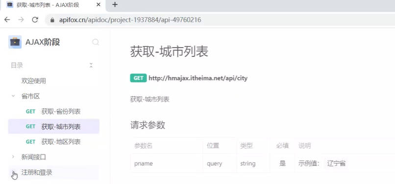
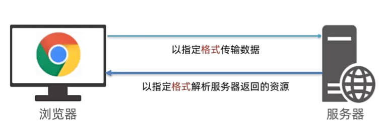
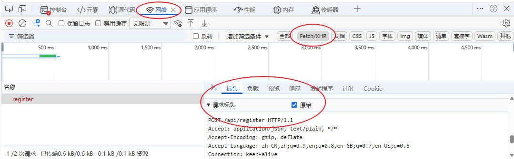

# AJAX

- 使用axios库，与服务器进行数据通信
- XMLHttpRequest对象的使用，了解AJAX底层原理

## 接口文档

- 接口文档:由后端提供的==描述接口==的文章
- 接口:使用AJAX和服务器通讯时, 使用的URL,请求方法,以及参数



## form-serialize插件

- 作用:快速收集表单元素的值

```html

<body>
  <form action="javascript:;" class="example-form">
    <!-- 
    参数1:要获得那个表单数据
    表单元素设置name属性,值会作为对象的属性名
    建议name属性的值,最好和接口文档参数名一致
    -->
    <input type="text" name="userame">
    <br>
    <input type="text" name="password">
    <br>
    <input type="button" class="btn" value="提交">
  </form>
  <!-- 
    目标：在点击提交时，使用form-serialize插件，快速收集表单元素值
  -->
  <!-- 引用插件 -->
  <script src='../lib/form-serialize.js'></script>
  <script>
    document.querySelector('.btn').addEventListener('click', () => {
      const form = document.querySelector('.example-form')
      /**
       * 参数2:配置对象
       * hash 设置获取数据的结构
       *      - true:JS对象(推荐) 一般请求体里面提交给服务器
       *      - false:查询字符串
       * empty 设置是否获取空值
       *      - true:获取空值(推荐) 数据结构和标签结构一样
       *      - false:不获取空值
      **/
      const data = serialize(form, { hash: true, empty: true })
      console.log(data); //{userame: '1111', password: '111'}

    })
  </script>
</body>
```

# axios库

## axios使用

1. 引用axios.js:(`https://cdn.jsdelivr.net/npm/axios/dist/axios.min.js`)
`<script src="https://cdn.jsdelivr.net/npm/axios/dist/axios.min.js"></script>`
2. 使用axios函数:传入配置对象,再用.then回调函数接收结果,并做后续处理

```js
axios({
  url:'目标资源地址'
}).then((result)=>{
  //对服务器返回的数据做后续处理
})

```

- 把省份数据放在页面上

```html
<body>
  <p class='my-p'></p>
  <script src="https://cdn.jsdelivr.net/npm/axios/dist/axios.min.js"></script>
  <script>
    //使用axios函数
    axios({
      url: 'https://hmajax.itheima.net/api/province'
    }).then(result => {
      console.log(result);
      console.log(result.data.list.join(`<br>`));
      document.querySelector('.my-p').innerHTML = result.data.list.join(`<br>`)
    })
  </script>
</body>

```

## axios- 查询参数

```js
axios({
  url:'目标资源地址'
  params:{
    参数名:值
  }
}).then(result=>{
  //对服务器返回的数据做后续处理
})
  /*
    获取地区列表: http://hmajax.itheima.net/api/area
    查询参数:
      pname: 省份或直辖市名字
      cname: 城市名字
  */
```

```html
<body>
  <!-- 
    城市列表: http://hmajax.itheima.net/api/city
    参数名: pname
    值: 省份名字
  -->
  <p></p>
  <script src="https://cdn.jsdelivr.net/npm/axios/dist/axios.min.js"></script>
  <script>
    axios({
      url: 'http://hmajax.itheima.net/api/city',
      //查询参数
      params: {
        pname: '山东省'
      }
    }).then(result => {
      console.log(result.data.list);
      document.querySelector('p').innerHTML = result.data.list.join('<br>')
    })

  </script>
</body>

```

## axios请求配置method

- url:请求的URL网址
- method:请求的方法,GET可以省略(不区分大小写)
- data:提交数据

```js
axios({
  url:'目标资源地址'
  method:'请求方法'
  params:{
    参数名:值
  }
}).then(result=>{
  //对服务器返回的数据做后续处理
})

```

```js
 axios({
        url: 'http://hmajax.itheima.net/api/register',
        method: 'post',
        //提交数据
        data: {
          username: 'itemima7898',
          password: '123456'
        }
      }).then(result => {
        console.log(result);
      })
```

## axios 错误处理catch

- 语法:在then 方法后面,通过点语法调用catch方法,传入回调函数并定义形参

```js
axios({
  //请求选项
}).then(result=>{
  //对服务器返回的数据做后续处理
}).catch(error=>{
  //处理错误
})

```

---

# 认识url

- 定义:统一资源定位符,定位地址.URL地址
- 网址,用于访问服务器上资源

## url组成

### http协议

- http协议:超文本传输协议,规定浏览器和服务器之间传输数据的格式



#### 请求报文

- 请求报文:浏览器按照HTTP协议要求的格式,==发给服务器内容==
- 请求报文的组成
  - 请求行:请求方法,URL,协议
  - 请求头:以键值对的格式携带的附加信息,比如`Content-Type`
  - 空行:分隔请求头,空行之后的是==发送给服务器的资源==
  - 请求体:==发送资源==



- 应用:错误排查

#### 响应报文

- 响应报文:服务器按照HTTP协议要求的格式,==返回浏览器的内容==
- 响应报文的组成
  - 响应行(状态行):协议,==HTTP响应状态码==,状态信息
  - 响应头:以键值对的格式携带的附加信息,比如`Content-Type`
  - 空行:分隔请求头,空行之后的是==服务器返回的资源==
  - 响应体:==返回的资源==
- HTTP响应状态码:用来表明请求是否成功完成

|状态码|说明|
|:---:|:---:|
|1xx|信息|
|2xx|成功|
|3xx|重定向消息|
|4xx|客户端错误|
|5xx|服务端错误|

### 域名`hmajax.itheima.net`

- 域名:标记服务器在互联网中方位
- eg:baidu.com 百度的服务器 ; <www.taobao.com淘宝服务器>

### 资源路径`/api/province`

- 资源路径:标记资源在服务器下的具体位置

## url查询数据

- 定义:浏览器提供给服务器的额外信息,让服务器返回浏览器想要的数据
- 语法:`http://xxxx.com/xxx/xxx?参数名1=值1&参数名2=值2`


## 常见的请求方法

- 请求方法:对服务器资源,要执行的操作

|请求方式|操作|
|:---:|:---:|
|GET|获取数据|
|POST|提交数据|
|PUT|修改数据(全部)|
|DELETE|删除数据|
|PATCH|修改数据(部分)|
